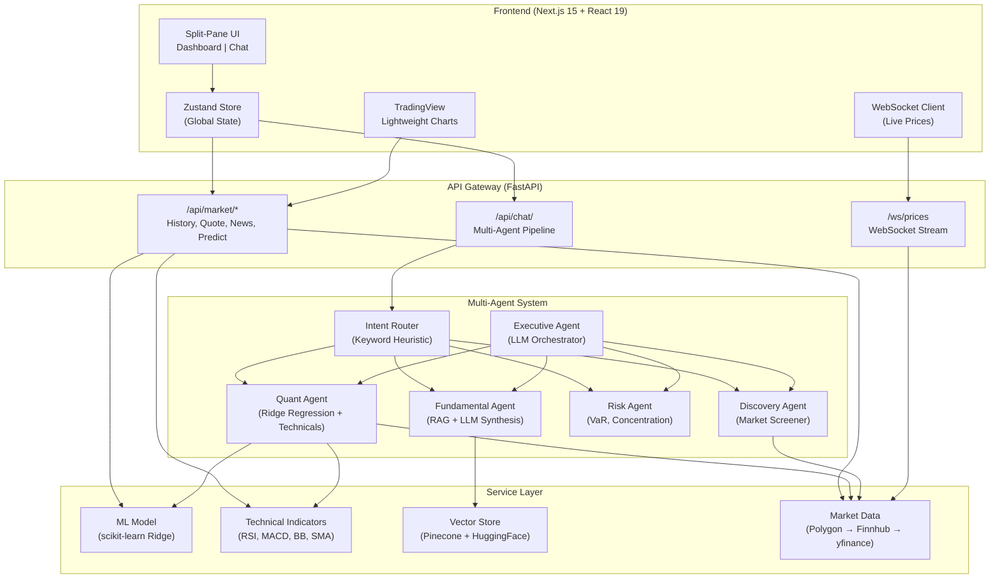

# AI Trading Co-Pilot


An AI-powered stock market research platform that uses a multi-agent architecture to help users make informed investment decisions. This project demonstrates advanced full-stack capabilities, integrating a highly interactive UI with a robust ML and AI-driven backend.

## 🚀 Features

- **Multi-Agent AI Backend**:
  The application utilizes a distributed, multi-agent orchestration pattern to ensure high-accuracy responses across different financial domains:
  - **1. Intent Router**: The entry point for user queries. It uses NLP keyword heuristics to classify user intents and route the request to the appropriate specialized sub-agent (Quant, Fundamental, Risk, or Discovery).
  - **2. Quant Agent (Short-Term)**: Specializes in technical analysis and statistical forecasting. It runs a custom Machine Learning model (L2 Regularized Ridge Regression) trained dynamically on historical OHLCV data. It computes 25+ technical indicators (RSI, MACD, Bollinger Bands) to provide short-term (5-day) price predictions and confluence signals.
  - **3. Fundamental Agent (Long-Term)**: Specializes in qualitative analysis. It leverages a Retrieval-Augmented Generation (RAG) pipeline to query SEC 10-K filings and recent financial news from a Pinecone Vector Database. It uses a LangChain LLM to parse this unstructured data and output strict, Pydantic-validated JSON sentiment scores.
  - **4. Risk Agent (Portfolio)**: Specializes in portfolio safety. It ingests the user's current holdings and calculates standard financial risk metrics, including 95% Value at Risk (VaR), portfolio beta, and sector concentration risks.
  - **5. Discovery Agent (Market Screener)**: Specializes in market-wide screening. It scans a curated, multi-sector basket of blue-chip stocks to find high-performing equities based on real-time P/E ratios, EPS, and market capitalization.
  - **6. Executive Agent (Synthesizer)**: The final orchestrator. It receives the highly structured output from the designated sub-agent and uses an LLM (Gemini/Groq) to synthesize it into a coherent, human-readable narrative. It outputs actionable BUY/SELL/HOLD signals, distinct reasoning points, and determines the necessary UI state changes (e.g., automatically switching the dashboard to a new ticker).
- **Real-Time Interactive UI**:
  - Split-pane Next.js dashboard featuring TradingView Lightweight Charts.
  - Live price WebSocket streaming.
  - Explainable AI (XAI) UI modules with confidence gauges and reasoning breakdowns.

## 🧠 System Architecture



## 🛡️ Reliability & Consistency

This application is engineered for production-grade reliability across three pillars:

- **Data Resiliency (Graceful Degradation)**: The market data pipeline uses an **API Cascade** pattern. It attempts to fetch high-fidelity data from premium endpoints (Polygon/Finnhub) first. If rate limits are hit or the service goes down, it seamlessly falls back to `yfinance`. A 5-minute TTL cache protects downstream providers from being overwhelmed.
- **LLM Consistency (Hallucination Prevention)**: The AI agents use **Structured Output Validation** (Pydantic + LangChain) to force deterministic JSON responses from the LLMs. If the LLM fails validation or lacks context, a graceful fallback mechanism intercepts the error and returns a safe, neutral response rather than crashing the UI. Furthermore, the Pinecone Vector Database is configured to dynamically embed missing tickers on the fly to prevent empty context windows.
- **Machine Learning Robustness**: The Quant Agent utilizes **Ridge Regression (L2 Regularized)**. By strictly enforcing a chronological train/test split (preventing look-ahead bias) and penalizing correlated technical indicators, the model avoids the wild, over-confident hallucinations often seen in poorly tuned Neural Networks.
- **System Stability**: The FastAPI backend implements a global exception handler and rate-limiting middleware, while the Next.js frontend wraps critical components in React `ErrorBoundary` modules to isolate component failures.

## 🛠 Setup Instructions

### 1. Prerequisites
- Docker & Docker Compose (Recommended)
- OR Local Setup:
  - Python 3.10+
  - Node.js 18+

### 2. Environment Variables
Create a `.env` file in the `backend/` directory by copying `.env.example`:
```bash
cp backend/.env.example backend/.env
```
Fill in the API keys (e.g., `GEMINI_API_KEY`, `PINECONE_API_KEY`). If left empty, the application will run using mock data and mock LLM responses.

### 3. Run with Docker (Recommended)
From the root of the repository:
```bash
docker-compose up --build
```
- Frontend available at: `http://localhost:3000`
- Backend API available at: `http://localhost:8000/docs`

### 4. Run Locally (Without Docker)

**Backend:**
```bash
cd backend
python3 -m venv .venv
source .venv/bin/activate
pip install -r requirements.txt
uvicorn main:app --reload --port 8000
```

**Frontend:**
```bash
cd frontend
npm install
npm run dev
```

## 🧪 Testing

The backend includes a comprehensive `pytest` suite for the ML models, intent routers, and technical indicators.
```bash
cd backend
pytest tests/ -v
```

## 📝 License
Educational Project. For informational purposes only. Not financial advice.
