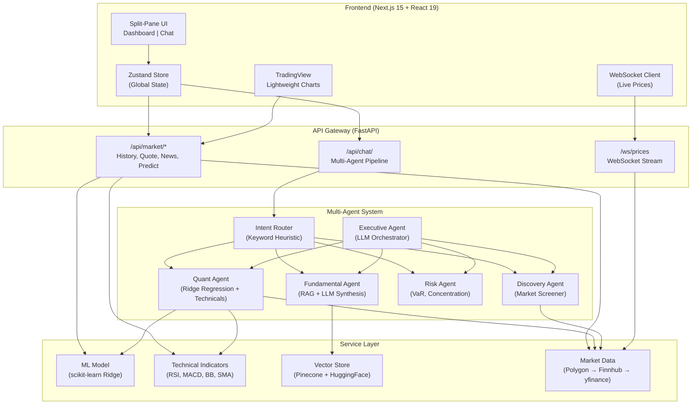

# AI Trading Co-Pilot


An AI-powered stock market research platform that uses a multi-agent architecture to help users make informed investment decisions. This project demonstrates advanced full-stack capabilities, integrating a highly interactive UI with a robust ML and AI-driven backend.

## 🚀 Features

- **Multi-Agent AI Backend**:
  - **Quant Agent**: Uses Machine Learning (Ridge Regression) on time-series data enriched with technical indicators (RSI, MACD, BB) to forecast prices.
  - **Fundamental Agent**: Leverages a Retrieval-Augmented Generation (RAG) pipeline over SEC 10-K filings and news using Pinecone Vector DB and LangChain.
  - **Risk Agent**: Analyzes portfolio state (e.g., Value at Risk, Diversification, Concentration).
  - **Discovery Agent**: Screens a basket of tech stocks for strong market fundamentals.
  - **Executive Agent**: Synthesizes inputs from sub-agents using a real LLM (Gemini/Groq) to provide structured buy/sell/hold signals with citations.
- **Real-Time Interactive UI**:
  - Split-pane Next.js dashboard featuring TradingView Lightweight Charts.
  - Live price WebSocket streaming.
  - Explainable AI (XAI) UI modules with confidence gauges and reasoning breakdowns.

## 🧠 System Architecture



## 🛠 Setup Instructions

### 1. Prerequisites
- Docker & Docker Compose (Recommended)
- OR Local Setup:
  - Python 3.10+
  - Node.js 18+

### 2. Environment Variables
Create a `.env` file in the `backend/` directory by copying `.env.example`:
```bash
cp backend/.env.example backend/.env
```
Fill in the API keys (e.g., `GEMINI_API_KEY`, `PINECONE_API_KEY`). If left empty, the application will run using mock data and mock LLM responses.

### 3. Run with Docker (Recommended)
From the root of the repository:
```bash
docker-compose up --build
```
- Frontend available at: `http://localhost:3000`
- Backend API available at: `http://localhost:8000/docs`

### 4. Run Locally (Without Docker)

**Backend:**
```bash
cd backend
python3 -m venv .venv
source .venv/bin/activate
pip install -r requirements.txt
uvicorn main:app --reload --port 8000
```

**Frontend:**
```bash
cd frontend
npm install
npm run dev
```

## 🧪 Testing

The backend includes a comprehensive `pytest` suite for the ML models, intent routers, and technical indicators.
```bash
cd backend
pytest tests/ -v
```

## 📝 License
Educational Project. For informational purposes only. Not financial advice.
